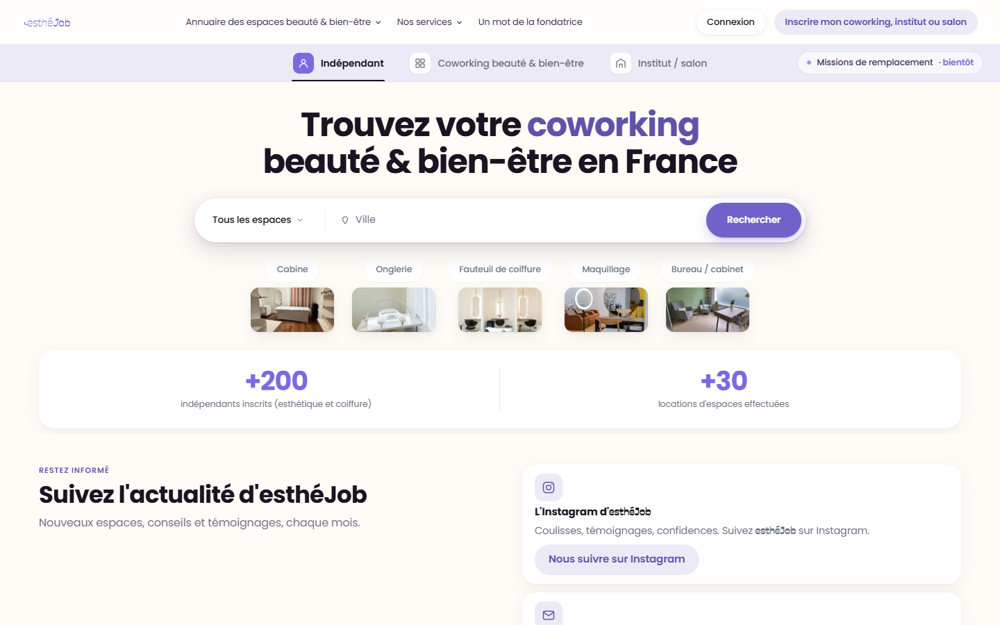
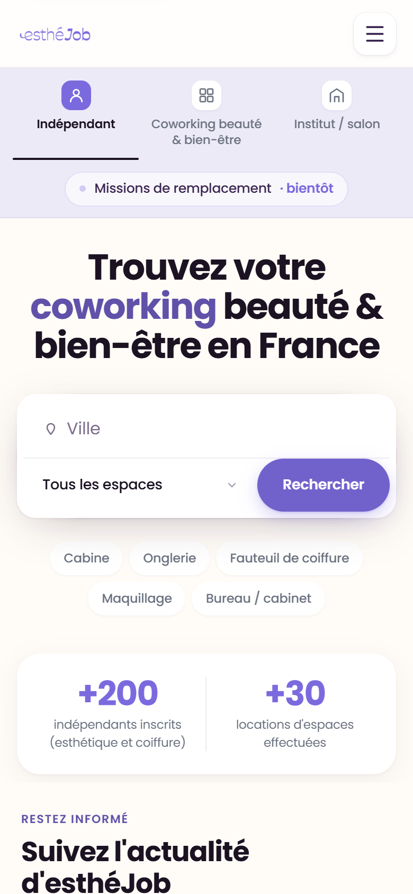
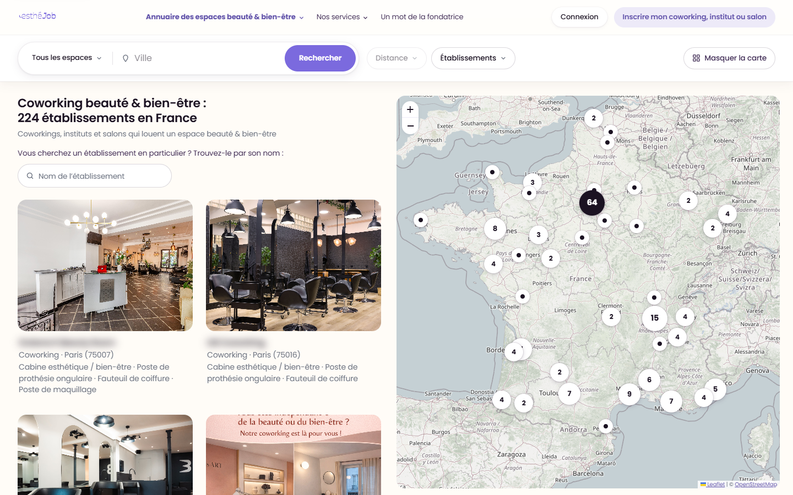
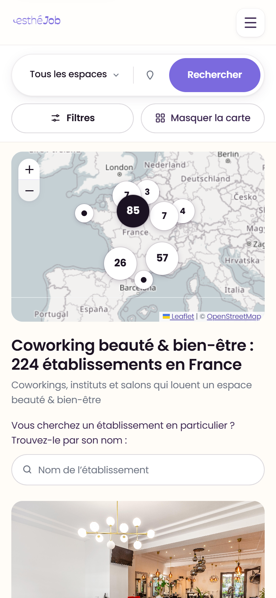
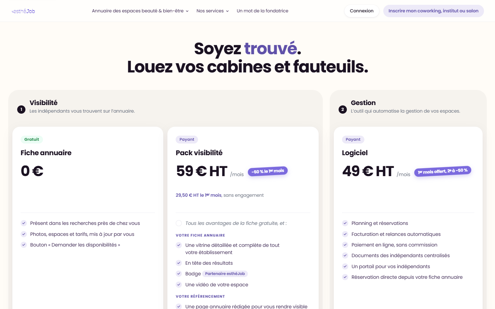
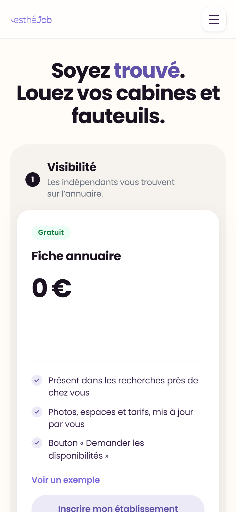
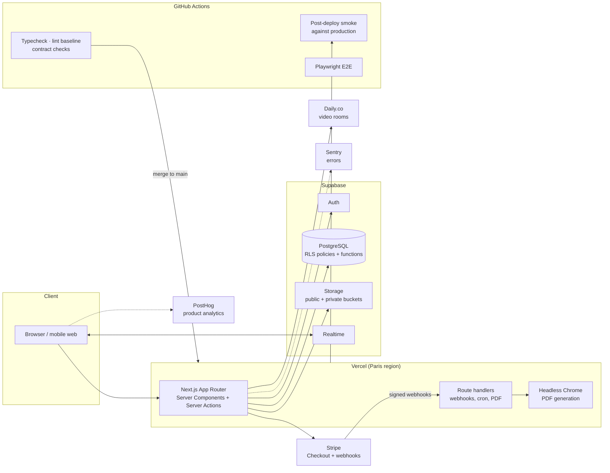

# esthéJob — B2B marketplace for the beauty & hairdressing industry

A live French marketplace that connects beauty and hairdressing salons, coworking spaces and freelance professionals for space rental, replacements and collaborations.

**Live:** [esthejob.fr](https://esthejob.fr) &nbsp;·&nbsp; **Role:** Founding / lead full-stack developer (May 2026 – present)

> **Source code is private (client project).** This repository is a case study: screenshots, architecture and engineering write-ups. I'm happy to walk through the real codebase in an interview.

---

## At a glance

| | |
|---|---|
| **1,500+** commits shipped in 5 months | about 1,500 of the repository's ~1,700 commits |
| **79** pages | public marketing/SEO pages, multi-role dashboards, admin back-office |
| **145** PostgreSQL migrations | schema, Row Level Security policies, database functions |
| **120+** Playwright end-to-end scenarios | plus custom CI contract checks and post-deploy smoke tests |
| **2** live products on one database | esthéJob and esthéJob Cowork share one Supabase project and one login |

## Screenshots

Public, logged-out pages only. Business names in the directory are blurred.

| Home (desktop) | Home (mobile) |
|---|---|
|  |  |

| Space directory with map (desktop) | Space directory (mobile) |
|---|---|
|  |  |

| Pricing for salons and spaces (desktop) | Pricing (mobile) |
|---|---|
|  |  |

## The problem

Independent beauty professionals and hairdressers need somewhere to work: a treatment room, a chair, a nail station, for a day or for months. Salons and beauty coworking spaces have empty capacity and need replacements when staff are away. Before esthéJob, both sides met through word of mouth, social media groups and phone calls. esthéJob gives them one place to find each other, publish offers, apply, message and collaborate.

## My role

I joined in May 2026 as the founding developer and took the product from a prototype to production. I own the codebase end to end: database design and RLS, server logic, UI, payments, testing, CI/CD, deployment and monitoring. The client owns product and design; I turn the designer's high-fidelity HTML prototypes into production UI.

## Key features

- **Multi-role dashboards** for salons/institutes, freelance professionals and administrators
- **Job and offer board** with sector and category filters and distance-bounded search
- **Coworking directory** with a clustered Leaflet map and per-establishment pages
- **Application workflow** (apply, review, accept, collaborate) with state guards on every transition
- **Real-time messaging** between the two sides
- **CV builder** with server-side PDF generation (headless Chrome in a serverless function)
- **Video interviews** using Daily.co
- **Stripe Checkout and webhooks** for paid listings and a small digital shop
- **Admin back-office** for users, offers, collaborations and financial overviews
- **SEO landing pages and a news section**, with all user-facing copy in French

## Architecture

More detail: [docs/architecture.md](docs/architecture.md).

## Engineering highlights

**A quality pipeline that replaces the reviewer.** The team ships to `main` directly, so CI has to catch what a reviewer would. Every push runs type-checking, lint against a recorded baseline (no new errors allowed), and a set of custom contract checks I wrote for rules that kept regressing: server actions must authorize themselves, analytics events must carry no personal data, test harnesses must never target production, security headers must be present, feature flags must gate what they claim to gate. Each check has a self-test proving it actually fails on a bad input. After every deploy, a smoke test waits for production to serve the new commit, runs against the live site and prints a clear roll-back verdict if something is wrong.

**A feature-flagged second vertical.** The product started with beauty only. I added hairdressing as a second sector behind a flag, so the new taxonomy, copy and screens could ship to production dark and be switched on without a deploy. A CI contract check keeps every sector-specific surface behind the flag.

**A 15-phase design-system migration.** The designer delivered a new generation of high-fidelity HTML prototypes covering both sectors, new pages and a terminology change. I mapped every prototype file to a live route, consolidated design tokens, and migrated the app in 15 phases, each a small branch with a Playwright visual comparison against the prototype at mobile and desktop widths.

**Two production apps merged onto one database with one login.** In September 2026 I moved the companion booking SaaS (esthéJob Cowork) onto esthéJob's database so both products share one account system while keeping separate domains. It was rehearsed end to end before the production cutover, with a scripted copy, a scripted rollback and table-by-table verification afterwards. Write-up: [docs/case-study-shared-database-merge.md](docs/case-study-shared-database-merge.md).

## Tech stack

| Layer | Technology |
|---|---|
| Framework | Next.js (App Router), React 19, TypeScript (strict) |
| Styling | Tailwind CSS v4 with hand-built components and design tokens |
| Data | Supabase: PostgreSQL, Auth, Row Level Security, Storage, Realtime |
| Payments | Stripe Checkout + webhooks |
| Video | Daily.co |
| Maps | Leaflet + OpenStreetMap |
| Documents | Server-side PDF generation with headless Chrome (puppeteer-core) |
| Validation | Zod |
| Testing | Playwright end-to-end scenarios, custom CI contract checks |
| CI/CD | GitHub Actions, Vercel, post-deploy smoke tests |
| Observability | Sentry (with event scrubbing), PostHog |

## Related

- [esthejob-cowork-security](https://github.com/Robin-Hmaidan/esthejob-cowork-security): security hardening and integration of the companion booking SaaS
- [Profile](https://github.com/Robin-Hmaidan)

---

Robin Hmaidan · robinhmiadan01@gmail.com
