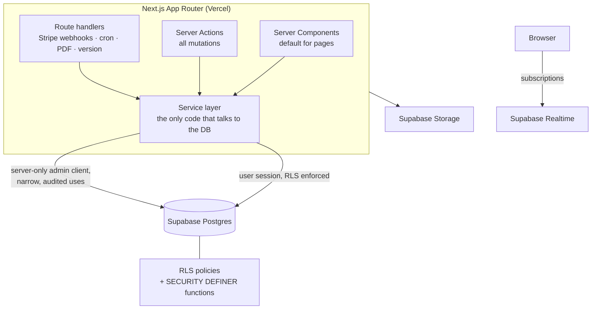
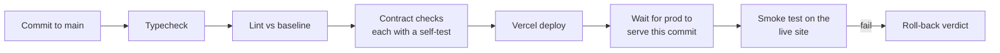

# esthéJob architecture

*Written by Robin Hmaidan, founding developer. The code is private; this document describes how the system is put together and why. Code snippets here are generic illustrations, not taken from the codebase.*

## Constraints that shaped the design

- **Small team, live product.** Real salons and freelancers use the site every day, and changes reach production quickly. Any rule that matters has to be enforced by code or CI, not by memory.
- **Several roles with very different views of the same data.** A salon, a freelancer, an admin and an anonymous visitor each see different things about an offer, a profile or an application.
- **French market, EU data.** All user-facing copy is French, and hosting sits in the Paris region (Vercel functions and the Supabase project).
- **Design fidelity.** The client's designer delivers high-fidelity HTML prototypes, and those prototypes are the reference for every screen.

## High-level shape



### Rendering and mutations

- **Server Components by default.** A component becomes a client component only when it needs interactivity. Most pages render on the server and stream HTML, which keeps the client bundle small and keeps data access on the server.
- **Server Actions for every mutation.** Forms post to Server Actions, which validate input with Zod, authorize the caller, then call the service layer. A CI contract check fails the build if a Server Action does not authorize itself before doing anything.
- **Route handlers only where something external calls in:** Stripe webhooks, a daily cron job, the PDF endpoint and a version endpoint used by the post-deploy smoke test.

### One service layer for all database access

Every database call goes through a service module (about 60 of them, grouped by domain: offers, applications, collaborations, messages, admin and so on). Pages and actions never build queries inline. That gives one place to reason about what each query can return, and one place to change when the schema changes.

There are two kinds of database client:

1. **The user-scoped client** carries the visitor's session. Row Level Security decides what it can read and write. This is the default.
2. **The admin client** bypasses RLS. It is server-only, never imported from client code, and used for a short list of operations that genuinely need it (for example admin back-office actions after an explicit role check).

### Row Level Security as the source of truth

Who can see what is written down as a visibility matrix (role × resource × field), then enforced in Postgres with RLS policies and in the service layer. The database is the final gate, so a bug in a page cannot leak another user's data.

A generic example of the pattern, not taken from the codebase:

```sql
-- Owners can read and update their own row; nobody else can.
alter table profiles enable row level security;

create policy "owner can read" on profiles
  for select using (auth.uid() = user_id);

create policy "owner can update" on profiles
  for update using (auth.uid() = user_id) with check (auth.uid() = user_id);
```

Multi-step state changes, such as moving an application through its lifecycle, live in Postgres functions so they happen in one transaction with the state checks inside. Functions that need elevated rights are `SECURITY DEFINER` with a pinned `search_path`, and execute rights are granted only to the roles that need them.

The schema has grown through 145 migrations, each a plain SQL file reviewed before it is applied.

## Integrations

| Concern | Choice | Notes |
|---|---|---|
| Auth | Supabase Auth | Email + password. Since September 2026 the same accounts also sign in to esthéJob Cowork (see the [merge case study](case-study-shared-database-merge.md)). |
| Files | Supabase Storage | Public buckets for listing photos; private buckets for documents and message attachments, protected by storage policies. |
| Messaging | Supabase Realtime | Conversations update live; messages are stored in Postgres under RLS. |
| Payments | Stripe Checkout + webhooks | Paid listing options and a small digital shop. Webhooks are signature-verified before anything is recorded. |
| Video | Daily.co | Video interviews between a salon and a candidate, behind a feature flag. |
| Maps | Leaflet + OpenStreetMap | Clustered map for the coworking directory; distance filters are a hard bound, enforced by a CI check. |
| PDF | puppeteer-core + serverless Chromium | The CV builder renders an HTML template to PDF on the server. It runs in its own function with more memory and a longer timeout than the rest of the app. |
| Errors | Sentry | Events are scrubbed of personal data before they leave the server or browser. |
| Analytics | PostHog | Consent-gated, with an allowlist of events and properties; a CI check rejects events that could carry personal data. |
| Scheduling | Vercel Cron | A daily job handles time-based notifications. |

## Feature flags and the second vertical

esthéJob started as a beauty-only marketplace. Hairdressing was added as a second sector behind a flag: categories, copy, filters and onboarding paths for the new sector all check the flag, so the work could merge to `main` and deploy continuously while staying invisible until launch. Video interviews use the same approach.

Flags only help if they are respected everywhere, so each flag has a CI contract check that scans for sector-specific or feature-specific surfaces that are not gated.

## Quality pipeline



- **Typecheck and lint baseline.** The lint step compares against a recorded baseline: existing warnings are tolerated and tracked, new ones fail the build.
- **Contract checks.** Small scripts that encode rules the team kept breaking: Server Actions must authorize, analytics must not carry personal data, test harnesses must not point at production, security headers must be set, flags must gate their surfaces, list pages must render an error state, the canonical category list must be the only one. Each check ships with a **self-test** that feeds it a known-bad input and asserts that it fails, so a check cannot silently rot into always passing.
- **Playwright end-to-end scenarios (120+).** They cover critical flows per role (publishing, applying, messaging, admin actions) and are also used as a visual loop against the designer's prototypes during migrations.
- **Post-deploy smoke.** After each production deploy, a workflow waits until the live site reports the new commit, runs a smoke suite against production and checks the canonical host. The output ends with a clear verdict, so a failure means "roll back now", not "investigate later".

## Design-system migration

The designer's prototypes are standalone HTML files. When a new generation arrived (both sectors, new pages, a terminology change), I:

1. Mapped every prototype file to a live route and classified it as update, new or reference-only.
2. Consolidated colours, typography and spacing into Tailwind v4 `@theme` tokens, so components use tokens and never bare hex values.
3. Split the work into 15 phases, each a branch small enough to review, with a Playwright comparison against the prototype at mobile and desktop widths before merge.

Where a prototype assumed data the product could not produce, I recorded the decision with the client instead of faking it in the UI.

## What I would point to in an interview

- The service layer plus RLS split, and how it limits the impact of mistakes in a page.
- The contract checks with self-tests, as a lightweight way to turn recurring review comments into enforcement.
- The post-deploy smoke test, which checks the deployed commit on the live site rather than a preview.
- The shared-database merge, covered in its own write-up.
